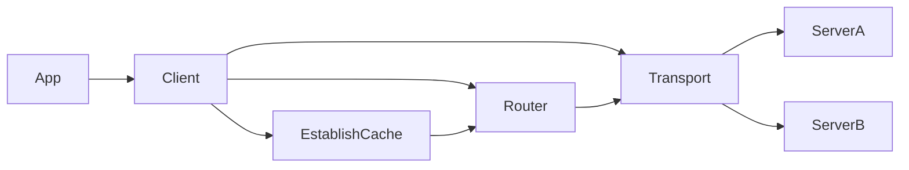

# Architecture

Application-facing API docs live in [`docs/README.md`](../docs/README.md). This `tech-docs/` tree is for
library developers and deep protocol/compatibility notes.

## Package layout

| Path | Role |
|------|------|
| Root `datorium` | Public `Client`, config/options, CRUD/search/establish APIs, typed `Collection[T]` layer |
| `shard/` | Document ID CRC32 slot + range parsing (ported from DatoriumDB) |
| `searchpath/` | Search result path encoding + shard slot |
| `refs/` | Parse `@__Collection__id` / `@@__Collection__id` |
| `internal/testtoken/` | Dev-only Ed25519 JWT minting for integration tests |
| `cmd/todo-integration/` | Host CLI for Milestone 6 demo |
| `test/integration/todo/` | Compose + establishment fixtures |

The client does **not** depend on `github.com/JohnAD/datoriumdb` packages. Protocol
logic is independently implemented and verified against contract shapes.

## Client boundaries

- **Transport** sends `Authorization: Bearer …`, posts `text/plain; charset=utf-8`
  command bodies, and always JSON-decodes the response body.
- **EstablishCache** stores `general`, `servers`, `shardMap`, `schemas`, `searches`, `auth`.
- **Router** picks SOT vs read-member base URLs from document/search shard slots.
- **Host rewrite** maps Docker-internal `baseURL`s to host-reachable URLs when set.

## Concurrency

- `Client` methods are safe for concurrent use after construction.
- Establishment refresh uses a mutex; in-flight readers may see the previous config until refresh completes.
- Callers own token lifecycle via a static string or `TokenSource`.

## Retry policy

1. On transport failure: optional bounded backoff retries (configurable).
2. On `wrongMachine`: always refresh establish, recompute the route locally (ignore bounce `correctServer`/`baseURL`; bounce `configVersion` is diagnostic only), retry up to a small bound.
3. On `versionMismatch`: surface typed error; optional helper re-reads and retries once.
4. Writes include a client-generated ULID `operationId` unless the caller supplies one.
5. **Create IDs** are always client-generated (ULID via `NewDocumentID` when the
   caller passes empty/`Void`). The access-language line is built once before
   network attempts. On `documentExists`, or after a transport error (optional
   delay via `CreateAmbiguousVerifyDelay`), a follow-up read may treat an
   existing document as an idempotent create success.

## Typed collections and document order

Applications declare `Collection[T]` descriptors (name + schema version) and
call `Bind` to obtain a `CollectionClient[T]` (lazy-establishes and validates
that collection on first Bind; optional `Establish` still validates a whole
catalog at startup). Typed writes build command detail objects with
[`ojson`](https://github.com/JohnAD/ojson) (`NewObjectFromStructTry` →
`ToJSONBytes`) so non-SOT field order matches Go struct declaration order.
Typed reads re-parse `sot` from the original response bytes into
`CollectionItem[T]` (`Doc` / independently decoded `OriginalDoc` / private
content baseline / `DocMeta` for `!` / `$` / `#`).

**Invariant:** never store or round-trip inbound DB JSON (envelopes, SOT,
schemas, cache summaries) as `map[string]any`. The client parses those with
ojson (`Result.Env`, `ReadResult.SOT`, `SchemaEntry.Doc`, etc.). Go maps
randomize keys; the server honors client order for non-SOT fields when
persisting git-friendly JSON.

Raw `Create`/`Patch`/`Delete` helpers that accept `map[string]any` remain as an
escape hatch and are order-unsafe for **outgoing** document content. Do not
“fix” maps by feeding them through ojson `NewObjectFromMap` (that sorts keys).
Prefer typed collection clients or hand-built `ojson.JSONValue` details via
`BuildCommandOrdered`.

### Typed patching

`CollectionClient` owns patch creation and send. `CreatePatchFromChanges` diffs
the private original baseline against `item.Doc` with the schema compiled at
`Bind`; `CreatePatch` validates hand-built `ojson.Patch` values the same way.
`PatchDoc` lowers a `CollectionPatch` to access-language `RFC6902`. Items and
patches carry a binding identity so they cannot cross collection clients.
Details: [`PATCHING.md`](PATCHING.md), [`docs/patches.md`](../docs/patches.md).
