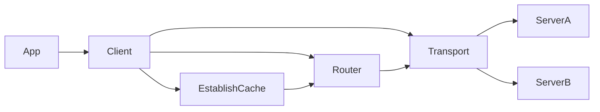

# Architecture

## Package layout

| Path | Role |
|------|------|
| Root `datorium` | Public `Client`, config/options, CRUD/search/establish APIs |
| `shard/` | Document ID CRC32 slot + range parsing (ported from DatoriumDB) |
| `searchpath/` | Search result path encoding + shard slot |
| `refs/` | Parse `@__Collection__id` / `@@__Collection__id` |
| `internal/testtoken/` | Dev-only Ed25519 JWT minting for integration tests |
| `cmd/todo-integration/` | Host CLI for Milestone 6 demo |
| `test/integration/todo/` | Compose + establishment fixtures |

The client does **not** depend on `github.com/JohnAD/datoriumdb` packages. Protocol
logic is independently implemented and verified against contract shapes.

## Client boundaries

- **Transport** sends `Authorization: Bearer …`, posts `text/plain; charset=utf-8`
  command bodies, and always JSON-decodes the response body.
- **EstablishCache** stores `general`, `servers`, `shardMap`, `schemas`, `searches`, `auth`.
- **Router** picks SOT vs read-member base URLs from document/search shard slots.
- **Host rewrite** maps Docker-internal `baseURL`s to host-reachable URLs when set.

## Concurrency

- `Client` methods are safe for concurrent use after construction.
- Establishment refresh uses a mutex; in-flight readers may see the previous config until refresh completes.
- Callers own token lifecycle via a static string or `TokenSource`.

## Retry policy

1. On transport failure: optional bounded backoff retries (configurable).
2. On `wrongMachine`: refresh establish if `configVersion` is newer/stale, rewrite URL, retry up to a small bound.
3. On `versionMismatch`: surface typed error; optional helper re-reads and retries once.
4. Writes include a client-generated ULID `operationId` unless the caller supplies one.
